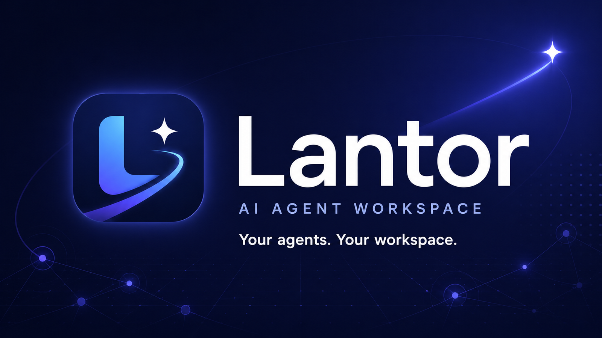

<p align="center">
  
</p>

# C-Lantor

This project is based on the original
[chenzl25/lantor](https://github.com/chenzl25/lantor). This fork keeps the
same local-first agent workspace direction, while adding a few capabilities for
long-running work and voice-first coordination.

The fork tries to stay feature-level compatible with upstream Lantor. Upstream
features and fixes are reviewed and selectively ported when they fit this
branch, instead of treating the fork as a completely separate product.

## What This Version Adds

- **Long Task support** - Codex-only long-running task support for work that
  should continue beyond a normal chat turn.
- **Call Mode** - a phone-style voice workflow for coordinating agents while
  speaking.
- **Built-in speech-to-text** - native transcription support for voice input.
- **Mobile access path** - this fork recommends using your own domain for
  mobile access; after opening the app, you can ask any agent in this branch
  how to set that up.
- **Personal workflow additions** - smaller opinionated changes such as message
  todos and other local workflow tweaks.

If there is a feature you want, you can also ask an agent to develop it on this
branch.

## Original README

The section below is based on the original Lantor README, with the old mobile
access recommendation removed.

# Lantor

**Local First. Private by default. Agents work in context you own.**

Lantor is a local-first AI agent workspace for Codex, Claude, and the agent
team you run yourself. It gives your agents channels, DMs, threads, tasks,
reminders, artifacts, and attachments so they can coordinate real coding work.

The important part is where it runs. Lantor has no hosted control plane, no
cloud workspace, and no extra backend that your project data has to pass
through. The desktop app, supervisor, SQLite database, attachments, chat
history, agent profiles, and agent workspaces all live on your Mac. Your
context is local SQLite and files you can inspect, back up, or extract.

Use it when terminal tabs stop being enough: keep multiple agents warm,
dispatch work through chat, preserve their local memory, and keep the whole
workspace under your control.

## Quickstart

Lantor is a native macOS desktop app. Install Node 20+ and Rust first:

```bash
brew install node
curl --proto '=https' --tlsv1.2 -sSf https://sh.rustup.rs | sh -s -- -y
source "$HOME/.cargo/env"
```

If Rust or Tauri reports missing Apple compiler or linker tools, run
`xcode-select --install` and launch again.

Clone and launch the app:

```bash
git clone https://github.com/xxhZs/C-Lantor.git
cd C-Lantor
npm install
npm run tauri:dev
```

When the desktop app opens, add your first agent:

1. Install and sign in to the CLI runtime you want to use. You only need the
   runtime for the agents you plan to run:

   ```bash
   # Codex
   npm install -g @openai/codex
   codex

   # Claude Code
   npm install -g @anthropic-ai/claude-code
   claude
   ```

2. In Lantor, create an agent, choose Codex or Claude, and point it at a
   workspace directory.
3. Mention the agent in a channel, DM it directly, or create a task. Lantor
   records the work item, wakes the local CLI runtime, and routes the response
   back into the right thread.

SQLite state lives at
`~/Library/Application Support/Lantor/lantor.sqlite`, attachments live under
`~/Library/Application Support/Lantor/attachments/`, and migrations run
automatically on every start.

## Why Lantor

- **Local First, privacy.** App, supervisor, SQLite state, attachments, and
  agent workspaces all run on your Mac.
- **You own your context.** Chat history, tasks, artifacts, attachments,
  agent profiles, and each agent's `MEMORY.md` / `notes/` stay on disk.
- **One human, many agents.** Channels, DMs, threads, tasks, and handoffs are
  shaped around a solo operator coordinating agent work.
- **Workspace, not just chat.** Messages can become tasks, threads carry
  context, and artifacts stay attached to the work that produced them.

## What's inside

- **Workspace primitives** - channels, DMs, threads, mentions, search, tasks,
  reminders, artifacts, and attachments.
- **Local supervisor** - durable inbox dispatch, queued runs, stop/retry,
  process lifecycle, run logs, and structured event ingestion.
- **Agent collaboration** - task claiming, task/thread handoff, progress
  activity, generated artifacts, and per-agent local memory.
- **Desktop + mobile access** - native macOS app plus a trusted-network web UI
  served by the same local process and SQLite database.

## How it works

Lantor is a native macOS app with a local supervisor. The desktop process
starts the same binary in supervisor mode; that supervisor owns agent process
launch, stop commands, queued work scheduling, run logs, and structured event
ingestion.

Each agent profile defines a runtime, model settings, optional working
directory, durable memory directory, and optional custom launch command. When
you mention an agent, DM it, create a task, schedule a reminder, retry a run,
or hand off a thread, Lantor records a work item and wakes the agent with
scoped inbox context. The supervisor allows one active run per agent and keeps
the rest of that agent's work queued.

Agents talk back in two channels:

- **Normal assistant text** is routed into the right channel, DM, or thread.
- **`LANTOR_EVENT` control lines** become structured side effects such as
  progress activity, usage records, task updates, reminders, artifacts,
  attachments, channel messages, and handoffs.

Storage stays local:

- **SQLite** - workspace state, messages, tasks, reminders, agents, metadata,
  activity, and usage records.
- **Attachments** - `~/Library/Application Support/Lantor/attachments/`.
- **Agent workspaces** - `~/Library/Application Support/Lantor/agents/<handle>/`
  by default (you can point each agent at any directory you like), including
  that agent's `MEMORY.md`, `notes/`, and durable task files.

The optional mobile web UI is served by the same local desktop process and
shares the same SQLite database and attachment store. There is still no
separate hosted Lantor service in the path.

## Mobile

The same desktop process also serves a mobile-friendly web UI, so you can read
threads, dispatch agents, and manage tasks from your phone without a separate
app or hosted Lantor service.

For this fork, using your own domain is the recommended mobile access path. The
exact setup depends on your network and security preference. Once Lantor is
running, you can ask any agent in this branch to help set up a domain-based
mobile route.

The browser UI shares the same desktop process and SQLite state, so channels,
agents, tasks, reminders, artifacts, and attachments all stay in sync.

Lantor has no built-in auth. Only expose it on a trusted private network or
behind access control. To lock the web UI down to loopback or turn it off, set
`LANTOR_WEB_BIND=127.0.0.1:8787` or `LANTOR_WEB_BIND=off`. See
[`docs/web-access.md`](docs/web-access.md) for details.

## Configuration

Defaults work out of the box. The two settings most users care about:

| Variable | Default | Purpose |
| --- | --- | --- |
| `LANTOR_DATABASE_URL` | `sqlite://~/Library/Application Support/Lantor/lantor.sqlite` | SQLite database URL. |
| `LANTOR_WEB_BIND` | `0.0.0.0:8787` | Web UI bind. Use `127.0.0.1:8787` for loopback only, or `off` to disable. |

Advanced options - attachment paths, web public URL, web bundle override, warm
Codex rotation - are in [`docs/configuration.md`](docs/configuration.md) and
[`.env.example`](.env.example).

## Documentation

- [Agent runtime model](docs/agent-runtime.md)
- [Control events](docs/control-events.md)
- [Configuration reference](docs/configuration.md)
- [Web access](docs/web-access.md)
- [Agent activity feed](docs/activity-feed.md)

Bug reports and feature requests are welcome via
[GitHub Issues](https://github.com/xxhZs/C-Lantor/issues).

## Development

```bash
npm run build                                              # frontend bundle
cargo check --manifest-path src-tauri/Cargo.toml           # rust typecheck
cargo test  --manifest-path src-tauri/Cargo.toml --no-run  # compile tests
npm run tauri:dev                                          # desktop app
```

## License

Apache-2.0
